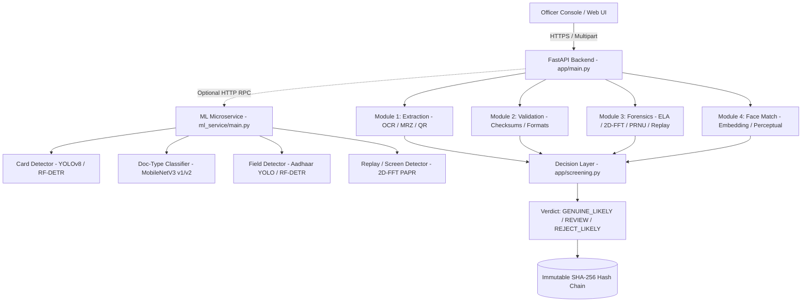

# Vibe Check Point — AI-Based Fake Identity & Document Screening

**Team:** crypto_knights  ·  **SIH26188** — AI-Based Fake Identity & Document Screening

> One-liner: *At a border inspection desk (a Vibe Check Point), an officer uploads an identity document
> (passport / visa / driving licence / PAN / voter ID) plus an optional live face capture.
> A four-module forensic pipeline — extract, validate, tamper-detect, face-match — returns a
> risk score and a CLEAR / REVIEW / FLAGGED verdict with one explainable reason per risk
> point, and produces a court-admissible dossier.*

---

## Table of Contents

1. [The Problem](#1-the-problem)
2. [The Solution](#2-the-solution)
3. [How Screening Works — The Four Modules](#3-how-screening-works--the-four-modules)
4. [Architecture](#4-architecture)
5. [Code Map](#5-code-map)
6. [Security & Privacy Model](#6-security--privacy-model)
7. [API Reference](#7-api-reference)
8. [Setup & Run](#8-setup--run)
9. [Deploying to Vercel](#9-deploying-to-vercel)
10. [Judge Q&A](#10-judge-qa)

---

## 1. The Problem

Border checkpoints handle hundreds of identity documents per shift. Forged passports,
tampered visas, cloned driving licences and PAN cards travelling under different names are
the currency of cross-border crime — yet the frontline decision is usually a tired officer
holding a document up to the light. Static rules miss:

- **Forged documents** — re-printed, re-saved, or digitally edited before printing.
- **Tampered genuine documents** — an authentic passport whose data page or portrait has been
  altered or digitally spliced.
- **Impostors** — a person carrying someone else's genuine document.

Misjudged identities don't just slip through once; the same numbers resurface at other
checkpoints, which is exactly how illegal cross-border networks operate.

## 2. The Solution

A screening console where every officer decision is supported by hard forensics instead of
eyeballing:

1. **Any document in, numbers out.** Upload a photo or PDF; the document's text, MRZ and
   declared fields are extracted automatically — nothing is stored on disk.
2. **Rule-based validation.** Check digits (ICAO 9303 MRZ), document-number formats (PAN,
   DL, Voter ID checksum rules), expiry, the six-month travel rule, and a hash-only watchlist.
3. **Digital tamper forensics.** ELA, 2D-FFT spectral analysis, and PRNU noise show *where*
   the document was re-saved or spliced — visible heatmaps, not just a number.
4. **Face match.** A live webcam capture of the person is compared against the document
   portrait to catch impostors.
5. **Human-in-the-loop.** AI produces a verdict — CLEAR / REVIEW / FLAGGED — with one
   explainable reason per risk point; a supervisor adjudicates. Every run is attributed to
   the screening officer and recorded in an audit trail.
6. **Court-admissible dossier.** Each report has a printable, HMAC-sealed dossier for legal
   proceedings.

## 3. How Screening Works — The Four Modules

| Module | What it does | Key signals |
|---|---|---|
| **M1 Extract** | Reads all text from the document — printed fields, the MRZ at the bottom of passports, and any declared numbers, from photos (Pillow) or PDFs (PyPDF). | OCR, MRZ lines, document-aware capture |
| **M2 Validate** | Checks the data, not just the pixels: MRZ check digits, document-number format, expiry dates, the six-month travel rule, travel validity, and a hash-only watchlist hit. | ICAO 9303 check digits, P&L/Voter-ID checksum rules, `travel_validity` |
| **M3 Tamper** | Three digital forensics on the image: Error Level Analysis (re-saved JPEG regions), 2D-FFT spectral (unnatural pixel patterns), and PRNU noise (digitally spliced portrait), with a YOLO ROI pre-check. | ELA heatmap Δ, PAPR, noise ratio, ROI labels |
| **M4 Face** | Compares the document portrait with a live camera capture of the person standing at the desk. | face-embedding cosine similarity (or perceptual dHash fallback) |

Output: `risk_score` (0–100) + verdict `CLEAR | REVIEW | FLAGGED` + per-reason `reasons[]`,
plus a four-module scorecard. Supervisors escalate non-clear results via `adjudicate`
(`CLEARED | CONFIRMED_FRAUD | INCONCLUSIVE`).

A **Cross-Border Syndicate Monitor** additionally analyses all recent screenings across
checkpoints for organised-fraud patterns: the same identity used at multiple posts, a cluster
of suspicious documents from one origin, or an individual flagged repeatedly.

## 4. Architecture

## 4. Architecture



### Environment Variables

| Variable | Default | Purpose |
|---|---|---|
| `DETECTOR_BACKEND` | `yolov8` | Global detector backend (`yolov8` or `rf_detr`). |
| `CARD_DETECTOR_BACKEND` | `yolov8` | Card boundary detector (`yolov8` or `rf_detr`). |
| `FIELD_DETECTOR_BACKEND` | `yolov8` | Aadhaar/ID field detector (`yolov8` or `rf_detr`). |
| `MRZ_DETECTOR_BACKEND` | `bottom20` | MRZ crop strategy (`bottom20` or `rf_detr`). |
| `DOCTYPE_BACKEND` | `v1` | Document type classifier (`v1` or `v2`). |
| `TAMPER_MODEL_BACKEND` | `heuristic` | Tampering forensics backend (`heuristic` or `patch_cnn`). |
| `ML_SERVICE_URL` | *empty* | Remote ML service URL (e.g. `http://localhost:8001`). If unset, runs in-process ONNX. |
| `ML_SECRET_KEY` | *empty* | Shared secret header `X-ML-Secret-Key` for ML microservice authentication. |
| `ML_ALLOW_NO_AUTH` | `false` | When `true`, permits unauthenticated ML calls during local development. |
| `HF_MODEL_REPO` | `koropanda/no-cap-detectors` | Hugging Face repository for downloading model weights. |
| `HF_MODEL_REVISION` | `main` | Git commit SHA or branch pinned on Hugging Face. |
| `MODEL_CACHE_DIR` | `ml_service/models` | Local directory for cached model weights and SHA-256 sidecars. |
| `DATABASE_URL` | `sqlite:///./nocap.db` | Database connection string (PostgreSQL or SQLite). |
| `MASTER_VAULT_KEY` | *dev-key* | Secret key for signing session cookies and audit hashes. |

### Quick Start

```bash
# 1. Clone & activate virtual environment
git clone -b ml/detector-v3 https://github.com/dikhyantsatpathy-ui/Vibe-Check-point.git
cd Vibe-Check-point
python -m venv .venv
source .venv/bin/activate  # Or on Windows: .venv\Scripts\Activate.ps1

# 2. Install dependencies
pip install -r requirements.txt

# 3. Run repo hygiene check & tests
python scripts/check_repo_hygiene.py
pytest -v -m "not slow"

# 4. Start backend & UI
python -m uvicorn app.main:app --host 0.0.0.0 --port 8000 --reload
```


**Zero-storage discipline:** document bytes and live captures are processed in memory and
never written to disk; the audit trail and watchlist store only hashes and *masked*
identifiers (e.g. `PAN: ABCT…23`, never the naked number).

## 5. Code Map

| File | Role |
|---|---|
| `app/main.py` | FastAPI app: admin auth (Google SSO / HMAC session), screening routes, adjudication, dossier, chat. |
| `app/screening.py` | The 4-module pipeline orchestrator and risk scoring. |
| `app/syndicate.py` | Cross-checkpoint syndicate / recidivism alert engine. |
| `app/forensics.py`, `app/tampering.py` | ELA / spectral / PRNU / YOLO ROI tamper detection. |
| `app/face.py`, `app/face_match.py` | Face comparison (embedding model or dHash fallback). |
| `app/mrz.py`, `app/validation.py` | ICAO 9303 MRZ parsing/check digits + document-number rules. |
| `app/identity.py`, `app/extraction.py` | PAN/DL/Voter-ID detection and text extraction (Pillow/pypdf). |
| `app/codebase.py` | Rule-based assistant blueprint / architecture index. |
| `frontend/src/views/AuthorityView.tsx` | The entire officer console UI. |
| `frontend/src/api.ts` | Typed API client. |
| `app/static/index.html` | Built frontend (Vite single-file), served by the backend. |

## 6. Security & Privacy Model

- **Google SSO + hard gate.** Officers authenticate via Google Identity Services; the
  `id_token` is verified server-side against `GOOGLE_CLIENT_ID`. Domain/email allow-lists
  (`ALLOWED_DOMAINS` / `ALLOWED_EMAILS`, override `SUPER_ADMINS`) gate access; a configurable
  hardcoded demo list keeps the owner unlocked when unset.
- **Screening duty is granted, never self-claimed.** A first sign-in has no role and is
  blocked from screening until a super-admin assigns post & institution via
  `/api/admin/assign_role` (the officer directory in the UI).
- **Stateless, constant-time sessions.** Login cookies are `email::HMAC(MASTER_VAULT_KEY,
  email)` verified with `hmac.compare_digest`, `HttpOnly`, `SameSite=Lax` (`Secure` on Vercel).
  Re-reading the identity row on every request makes privilege changes immediate.
- **Zero PII at rest.** Screenings store masked fields only; the watchlist stores SHA-256
  hashed identifiers; no document bytes or images are persisted.
- **Rate limiting** via slowapi on auth and screening routes; WAF-grade response headers
  (`nosniff`, `DENY` framing, HSTS); CORS restricted to the app origin.

## 7. API Reference

| Endpoint | Auth | Purpose |
|---|---|---|
| `POST /api/admin/login` | — | Google OAuth ID token → `SignerIdentity` + HttpOnly session |
| `POST /api/admin/logout` | cookie | Clear session |
| `GET /api/admin/me` | cookie | Officer profile: name, role, `pending_approval`, `is_super_admin` |
| `POST /api/admin/assign_role` | **super-admin** | Assign/approve an officer's post & institution |
| `GET /api/admin/signers` | **super-admin** | Officer directory for role approvals |
| `POST /api/screen` | cookie (approved role) | Run the 4-module screening on a document (+ optional live frame) |
| `GET /api/screen/queue` | cookie | Pending (supervisor) + recent screenings |
| `GET /api/screen/reports/{id}` | cookie | Queue-shaped summary for one report |
| `POST /api/screen/reports/{id}/adjudicate` | **super-admin** | CLEARED / CONFIRMED_FRAUD / INCONCLUSIVE |
| `GET /api/screen/watchlist` | **super-admin** | Hash-only watchlist entries |
| `POST /api/screen/watchlist/add` | **super-admin** | Hash an identifier + reason onto the watchlist |
| `POST /api/screen/watchlist/remove` | **super-admin** | Remove a watchlist entry |
| `GET /api/screen/syndicate-alerts` | cookie | Cross-checkpoint pattern alerts (optional checkpoint filter) |
| `GET /api/screen/shift-export` | **super-admin** | Signed CSV shift log |
| `GET /api/screen/dossier/{id}` | cookie | Printable HMAC-sealed court dossier (HTML) |
| `POST /api/chat` | cookie | Rule-based officer assistant (offline knowledge base) |

## 8. Setup & Run

```bash
git clone <repo-url> && cd crypto
python -m venv .venv
.venv\Scripts\activate                 # Windows (Linux: source .venv/bin/activate)
pip install -r requirements.txt
copy .env.example .env                # then fill real values
uvicorn main:app --port 8000          # run from app/  (or double-click START.bat)
```

Or double-click **START.bat** (Windows), which installs Python + npm deps, rebuilds the
single-file frontend, and starts the server on http://127.0.0.1:8000.

**Environment variables** (`.env`, gitignored):

| Variable | Required | Purpose |
|---|---|---|
| `DATABASE_URL` | yes | Neon PostgreSQL connection string (only supported database; no SQLite) |
| `MASTER_VAULT_KEY` | yes | 32+ byte master key for session-HMAC and evidence seals (with key separation) |
| `GOOGLE_CLIENT_ID` | yes | Google OAuth 2.0 client (GSI + backend ID-token verification) |
| `SUPER_ADMINS` | no | Comma-separated admin emails granted root clearance (exact match, no pattern wildcards) |
| `ALLOWED_DOMAINS` / `ALLOWED_EMAILS` | no | Authorisation allow-list driven by Google Cloud |
| `KEEPALIVE_INTERVAL` | no | Neon wake-up pinger interval in seconds (default 45; `0` disables). Auto-disabled on Vercel. |
| `AI_DETECTOR_PROVIDER`, `AI_DETECTOR_KEY`, `AI_DETECTOR_ENDPOINT` | no | Optional cloud tamper-detector backends (blank → local heuristic) |
| `FACE_EMBED_MODEL` | no | ArcFace/FaceNet-style `.onnx` for production face matching (e.g. `data/models/w600k_r50.onnx`) |
| `YOLO_ROI_ONNX_PATH` | no | Local ID-card ROI detector (worker only; auto-loads `app/models/card.onnx`) |
| `AADHAAR_FIELDS_ONNX_PATH` | no | 5-class Aadhaar field detector (`app/models/aadhaar_fields.onnx`) via `yolo_roi.extract_aadhaar_fields` |

## 9. Deploying to Vercel

The repo ships `api/index.py` (serverless entrypoint) and `vercel.json`. The Vite frontend
builds to the tracked `app/static/index.html`, served with `Cache-Control: no-store`.

1. Push to GitHub (or use the `vercel` CLI from this folder).
2. Set the same env vars in the Vercel project dashboard as your local `.env`
   (`DATABASE_URL`, `MASTER_VAULT_KEY`, `GOOGLE_CLIENT_ID` at minimum).
3. `VERCEL=1` is injected automatically: the session cookie gets the `Secure` flag, the Neon
   keepalive thread is disabled, and the AI/tamper forensics gracefully degrade to on-device
   heuristics when cloud providers aren't configured.
4. Cold starts: Neon + dependency import can take a few seconds on the first hit — the engine
   retries DNS/connect and treats table bootstrap as best-effort.

### Database Architecture (Neon Postgres Only)

Per security and compliance requirements, **Neon PostgreSQL is the sole database**.
All SQLite and local SQL fallbacks have been eliminated: if the database is unreachable,
the application fails loudly with a clear diagnostic instead of silently degrading to an
ephemeral or desynchronised local store. Connection pooling and retry-with-backoff handle
serverless cold starts seamlessly.

## 10. Judge Q&A

**Q: How does this beat a forged document that already fooled an officer?**
A: Validation is algorithmic: ICAO 9303 MRZ check digits and PAN/DL/Voter-ID checksum rules
reject documents with internally inconsistent numbers, and the forensics module marks
re-saved/spread-region edits and spliced portraits visibly. A document that is *valid* but
*fake* still fails one of the four modules — which is why the verdict is per-module and
explainable.

**Q: What makes the screening trustworthy rather than just a black-box AI?**
A: Three properties: the verdict is **rule-first** (checksums, formats, expiry), the tamper
module outputs **heatmaps and metrics** (ELA Δ, PAPR, noise ratio) a supervisor can read, and
every FLAGGED result goes through **human adjudication** — the AI suggests, the officer
decides.

**Q: What about privacy?**
A: Zero-storage discipline — document bytes and live captures exist only in memory; the
database keeps masked identifiers and hashes. The watchlist stores SHA-256 hashes, never raw
numbers, so it can't leak identity data.

**Q: How do you stop an impostor using a genuine document?**
A: Module 4 compares the live face capture with the document portrait (embedding-model cosine
similarity, with a perceptual dHash fallback that runs on Vercel today). Combined with the
syndicate monitor, an impostor's identity also trips cross-checkpoint alerts.

**Q: How is the role system real?**
A: Screening requires an approved post & institution set only by `/api/admin/assign_role`.
A sign-in without an approved role is blocked server-side; officers cannot claim their own
title.

**Q: What if Google or the cloud AI provider is down?**
A: Screening still runs: heuristic AI detection and the OCR/forensics pipeline are on-device,
OAuth verify failure simply denies login. The demo never depends on external availability.

---

*Vibe Check Point — SIH26188: AI-Based Fake Identity & Document Screening.*
© 2026 · Team crypto_knights.